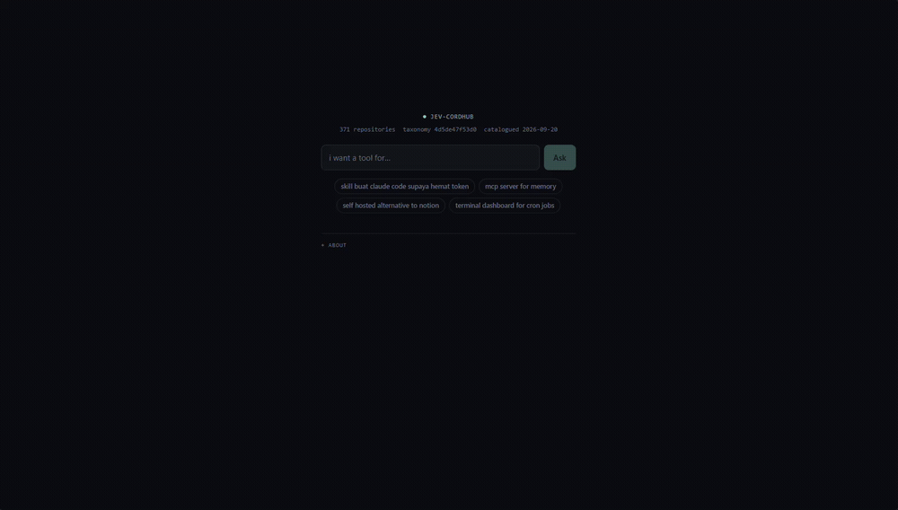

# jev-cordhub

Search a Discord channel that was used as a GitHub bookmark pile. Ask in plain language, get back
the repositories that fit.



## The problem

A channel between friends that does exactly one thing: someone finds a repository worth keeping and
drops the link in. No caption, no reaction, no thread. It works for about two months. After that,
the only way to find the headless-browser scraper you remember is to scroll.

It holds 371 repositories, and almost none of the links came with a note saying why they were worth
keeping. There is no commentary to search, so everything worth searching has to come from the
repositories themselves.

## How it works

[TypeSafe's Jev](https://typesafe.ai) is a System One model, which means it does not write text.
Give it a state and a typed question, and it returns a typed answer with probabilities. There is no
prose to parse.

So it cannot describe a repository. What it can do is read public metadata and judge it, which is
what an unannotated bookmark pile needs.

Every repository is judged once, on three questions: what you would want it for, how you consume
it, and how ready it is. Each category carries a hand-written description, and that description is
what the label means to a search. That is the part that makes this work: a repository described as
"Rust-based platform for the Web" would never answer somebody looking for a build tool, unless a
label says it is one.

Then, per question, the whole catalogue is judged for relevance and the results come back ranked,
with a relevance figure and a separate confidence figure.

A question the catalogue cannot answer returns nothing rather than the least bad guess. Ask for a
CLI-building library, for example, and it says so, because the channel contains none.

## Running it

```bash
bun install
bun run dev
```

Needs `TYPESAFE_API_KEY`, read from the environment or from the `.env` one level above this
repository, which development picks up automatically. Search is a server route, so the key never
reaches the browser.

```bash
bun run verify   # typecheck and tests
bun run build    # production build via adapter-node
```

A search costs about half a cent and takes two to three seconds.

## How the catalogue is built

| Stage | Reads | Writes |
| --- | --- | --- |
| Harvest the channel | the Discord API | `messages.jsonl`, 394 raw messages |
| Enrich from GitHub | `messages.jsonl` | `repos.jsonl`, 372 repositories with topics, language and stars |
| Label with Jev | `repos.jsonl` | `labels-<hash>.jsonl`, three judgements per repository |
| Build the catalogue | the two above | `catalog.json`, the file this repository ships |

The first three stages live outside this repository, because the first one reads a private Discord
channel. The catalogue they produce is committed, so a clone runs immediately with no setup.

## Limits

It knows about 371 repositories that four people thought were worth keeping, and nothing else. This
is not a GitHub search engine.

Relevance is a model judgement, not verified accuracy. It says a repository is about what you asked,
not that it works or that it is good. The confidence figure is noisy in both directions, so it
marks what is worth a second look rather than deciding for you.

## Credits

Built on [Jev](https://typesafe.ai) from TypeSafe AI, and informed by
[jev-search](https://github.com/superagents-lab/jev-search), which uses the same model for a
rather different job.
